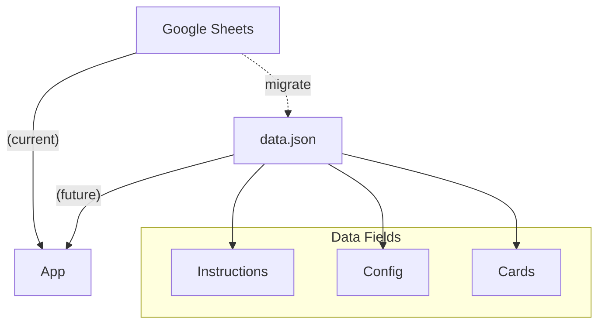

# Plan: Change App to Read Text Data from Static JSON

## Objective

Migrate all text data currently read from Google Sheets to a static JSON file, and update the app to read from this file instead.

---

## 1. Identify Data to Migrate

The app currently reads the following from Google Sheets:
- **Instructions**: Heading and body for user instructions.
- **Cards**: Each card has fields such as:
  - `id`
  - `cardName`
  - `shortText`
  - `cardSummary`
  - `pros` (semicolon-separated, to become an array)
  - `cons` (semicolon-separated, to become an array)
  - `aka` (semicolon-separated, to become an array)
  - `whythisanimal`
  - (Any other fields present in the sheet)
- **Config**: (If present) Drop zone labels and other UI configuration.

---

## 2. Proposed JSON Structure

```json
{
  "instructions": {
    "heading": "Feedback Animal Cards Instructions",
    "body": "Use the Feedback Animal Cards to better understand different feedback styles. Assume that everyone has good intentions at heart, we just have different feedback approaches.; 1. Read each of the Feedback Animal Cards.  Learn more about each animal by clicking on the card.; 2. Select and drag the Feedback Animal card onto the table. Choose the card that feels most like you in your current role; 3. Use these insights as part of team building, or start a conversation with your coach on how to grow your feedback skills. You'll find more information on how to use the Feedback Animal Cards here;  4. To reset, just refresh your screen."
  },
  "cards": [
    {
      "id": "card1",
      "cardName": "Owl",
      "shortText": "I provide clear step-by-step instructions based on my experience.",
      "cardSummary": "I have experience and provide detailed task instructions, so no one wastes time. I offer prescriptive, step-by-step guidance. I know how to do this well and am clear on the expected outcomes. \"I'll tell you what to do\" approach.",
      "pros": [
        "I have experience doing this and provide detailed instructions, so that no one is wasting their time.",
        "I provide clarity in what good looks like.",
        "I make it easy to measure or review progress."
      ],
      "cons": [
        "This style fails when there is no defined \"right way\" to proceed.",
        "I can come across as condescending or assuming the receiver lacks knowledge.",
        "It doesn't build the receiver's problem-solving capabilities, especially when the \"why\" is missing"
      ],
      "aka": [
        "Instructor",
        "Expert"
      ],
      "whythisanimal": "In many cultures the owl symbolises wisdom and knowledge.  They are perceived as having insight and keen powers of perception."
    },
    {
      "id": "card2",
      "cardName": "Lorikeet",
      "shortText": "Feedback is a 2-way conversation where we can  both learn.",
      "cardSummary": "Feedback is always a two-way conversation. I enter with curiosity and intent to learn, as well as advise. The best outcome is when the receiver finds their own solution.",
      "pros": [
        "The recipient owns the insight and is more likely to act on it.",
        "I respect my team member's existing expertise.",
        "My style builds long-term problem-solving capabilities."
      ]
      // ...other fields as present in the sheet
    }
    // ...more cards
  ]
}
```

---

## 3. Migration Steps

1. **Export Data**: Export all Google Sheets data to a JSON file in the above format.
2. **Add JSON to Project**: Place the JSON file (e.g., `data.json`) in the project directory.
3. **Update App Code**:
    - Change all code that fetches/parses Google Sheets data to instead fetch and parse `data.json`.
    - Update all references to use the new JSON structure.
    - Remove or disable any code related to Google Sheets API/network requests.
4. **Test**: Ensure all features work as before, but now use the static JSON file.

---

## 4. Data Fields Included

- **instructions**: `heading`, `body`
- **cards**: `id`, `cardName`, `shortText`, `cardSummary`, `pros` (array), `cons` (array), `aka` (array), `whythisanimal`, and any other fields present in the sheet for each card.

---

## 5. Diagram



---

**Next Step:**  
Switch to code mode to implement this migration.